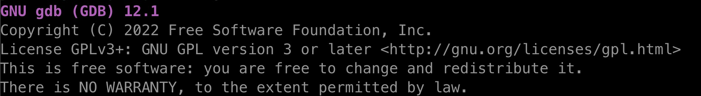
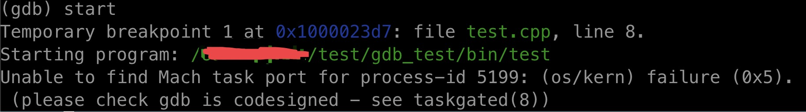
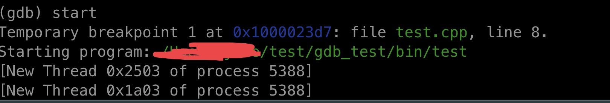
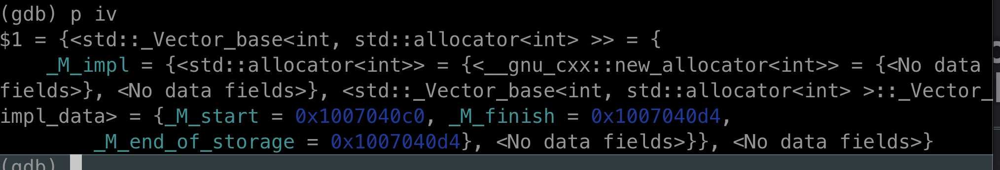
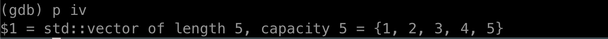

# gdb_config_in_mac
config gdb in Mac

## install gdb

```bash
brew install gdb
brew link gdb
brew link --overwrite gdb
gdb --version
```



## error1 - (os/kern) failure (0x5) (please check gdb is codesigned - see taskgated(8)



## solution1 - modify keychain

- https://blog.csdn.net/code_source/article/details/78076118
- https://sourceware.org/gdb/wiki/PermissionsDarwin

## error2 - new thread but cannot run



## solution2 - config with .gdbinit

```bash
echo "set startup-with-shell off" >> ~/.gdbinit
```

## run with root

```bash
sudo gdb a.out
```

## error3 - cannot print container element of stl



## solution3 - config python printer and make with ‘-gdwarf-3’

```bash
# find python printer 
find / -iname "*libstdcxx*" 2>/dev/null

# replace path with parent directory of the above result
echo "
python
import sys 
sys.path.insert(0, '/usr/local/Cellar/gcc@11/11.3.0/share/gcc-11/python')
from libstdcxx.v6.printers import register_libstdcxx_printers 
register_libstdcxx_printers (None)
end
" >> ~/.gdbinit
cd ./src
g++ -gdwarf-3 test.cpp -o ../bin/a.out
sudo gdb ../bin/a.out
```



